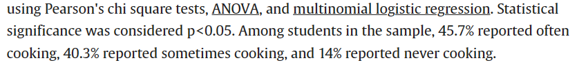
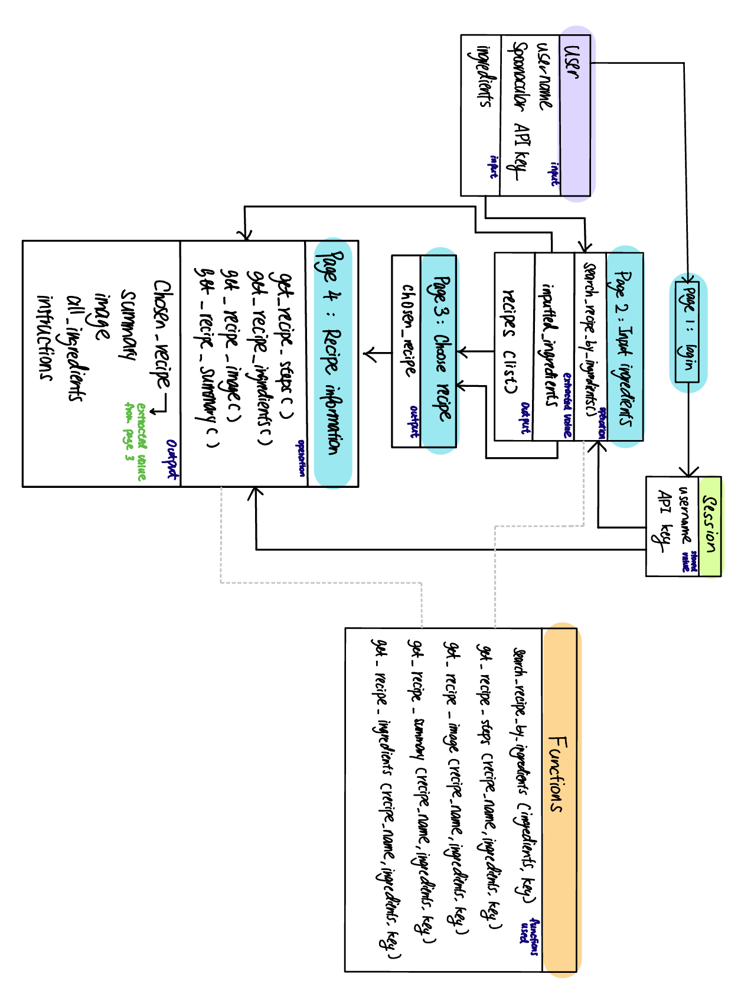
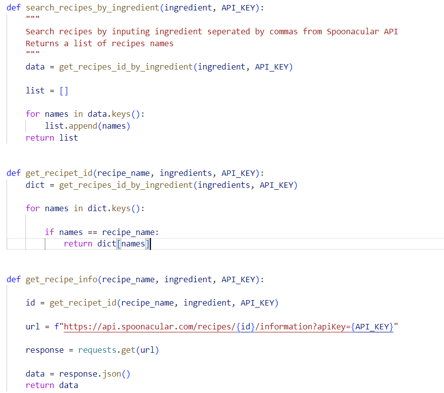
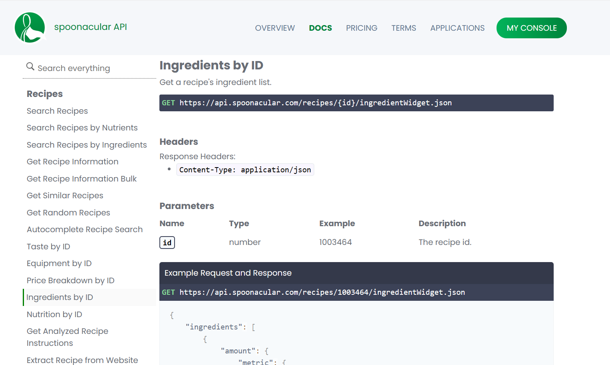

# Final Team Project: Recipe Generator

This is the repository for the final project of OIM 3640-02 2024 Spring

## Team Members

Marissa Yang and Xinjia Chen

## Big Idea/ Goal/ Why did we do this?

We realized for alot of college students as well as young adults who are overwhelmed by daily schedules, cooking can be an albatrass where they experienced difficulty with deciding what to cook and how to cook with limited ingredients in their fridge. Based on our research, around 14% of college students conducted by the research of the University of North Carolina at Chapel Hill has never cooked. As such, we intend to help these students with cooking.

To help these young adults eat healthy from home, we deviced a website where they can simply input ingreditents they have on hand, and we help them generate a list of potential meals from which they can choose and get further detailed information on. The whole website is built upon the background story of Disney character Ratetouille to spice up their lives with a bit more fun and joy. Akin to Disney's concept of the happiest place on earth, we want to make our users feel welcomed and delighted when visiting out website.


### Data mentioned from the research of the University of North Carolina at Chapel Hill


[Read more](<https://www.sciencedirect.com/science/article/abs/pii/S1878450X21000020>)

## User Instructions

Below are step by step instructions for how to use the website.

### Step 1: Login

You are required to input thier username and Spoonacular API key in the first page.

Spoonacular API key can be derived from the link: [Spoonacular API Key](<https://spoonacular.com/food-api/console#Dashboard>)

### Step 2: Input available ingredients

You are then asked to input ingredients they have on hand where different ingredients are seperated by ",".

For example: "Apple, Pear, Banana, Milk"

### Step 3: Choose recipe

The website will provide a list of possible recipes for you to choose from. Simply click on the recipe you like to obtain more information about the recipe.

If you wish to start over, simply click the start over option at the bottom to insert different ingredients.

### Step 4: Get more information about the recipe

For the recipe selected in step 3, the website will provide more information about the recipe including: short description, image, ingredients needed with measurement, and a step by step instruction.

If you wish to start over, simply click on the option at the bottom to return to home page.

### Additional Page: Error page

If there is any error occuring (404 error), the error page will inform you of the error and provide the option of returning to the home page to try loading the page again.

## Implementation Information



This is a hand-drawn simple class diagram of how the website works.

The purple node represent the user, blue nodes denotes different webpages displayed, green node symbolize the "session" function where information are stored, and the orange node is the pre-built functions that are used in webpages.

For each node, inputed data or information go through operations of different functions pre-devised and stored in a python file called "functions" to generate outputs that are extracted and passed on to the next node.

The session node is a built in function in flask where the value is stored in "session" with a secret key that allows easy access of the stored value across different web pages.

Note that the "inputted_ingredients" variable actually flow from page 2 to page store and stored as an input on page 3 that is latter reference by page 4. The arrow in the diagram directed "inputted_ingredients" straight from page 2 to page 4 simply for indication that the information is the same while the actual flow might not be the same.

## Results

Below is a link to a video demonstrating how to use the website in simple sense. Here the user "Bob" furnished the website username and Spoonacular API Key. Then, he feeded the website with available ingredient, choosed a recipe, and optained more informaiton about the recipe.

[Video of how to use the website](<https://babson-my.sharepoint.com/personal/zyang3_babson_edu/_layouts/15/stream.aspx?id=%2Fpersonal%2Fzyang3%5Fbabson%5Fedu%2FDocuments%2F%E9%99%84%E4%BB%B6%2FRecording%202024%2D04%2D26%20152720%2Emov&ct=1714160210276&or=OWA%2DNT%2DMail&cid=50078051%2D6de4%2D2b6f%2Dccf9%2D4cd931597e3b&ga=1&LOF=1&referrer=StreamWebApp%2EWeb&referrerScenario=AddressBarCopied%2Eview>)

## Project Evolution/Narrative

Below are development journey of our team along with difficulties and solutions we soughted out for each stage.

### Stage 1: Developing functions

The most difficult part for us initially was creating function because upon reviewing the spoonacular API, we realized that Spoonacular API are not built in a flow where we can, for example, simple extract more information about a recipe by providing the recipe name. Instead, we need to find the specific ID for each recipe to conduct the search. (See appendix 2)

This results in alot of reworks where we need to create new functions to record the ID of the list of recipes rendered by generating a dictionary with recipe names as keys and IDs as itmes. When the user chooses a specific recipe, we then need to insert the ID instead of the recipe name into new functions to extract useful information. (See appendix 1)

We also noticed that Spoonacular API keys has a daily limite of 150 uses which posted a major hurdle when we try to test the webiste during development and function building stage. Considering how using our own Spoonacular API keys in the functions might provide a bad exprience for users, we decided to add in a login page to let users input thier own API keys instead. This step, while easy in theory and our minds, made us renovated all the functions built, as a new input varaibles "API_key" needs to be introduced to all functions as well as in the "app.py" file.

Since API key is an essential input needed in every page, we want to pass the value to all pages and allow more easy access tha repetitively having the scrape the "API_key" in every web page. To fullfill the need, we learned a new function called "session" in flask with the help of ChatGPT. It has a similar concept to a locker where, with a encrypted secret key, we can store inputted values in the "locker" and allow access of the value simply with the function "session.get()". This helped us alot as we won't need to extract the API information everytime.

Addtionally, after building the basic functions, we added additional functions like getting images of the recipe to add more visual appearence and information to users.

#### Appendix 1.Recipe functions



#### Appendix 2: Spoonacular API Functions



### Stage 2: Developing website pages

Redirect from a web page to another is a challenge we encountered in this stage, as in class we only covered how to get from a single page to a result page and terminates there. With the help of ChatGPT, we learned to use "post" method where we can simply extract information from the previous webpage and input it into the next webpage where new results will be rendered.

Another problem we encountered was to pass on the inputed ingredients information across webpages, so we included the line:```<input type="hidden" name="ingredients" value="{{ input }}>```where the "input" inserted in the page is passed on as a input named as "ingredients" that can be easily referenced in the next page.

Additionally, another interesting thing we found was that the short summary we extracted for each recipe is actually already formatted in html style, which means when we input the summary into the web page, we need to find a way to have html treat it as html rather than text. We learned to use ```{{summary | safe}}``` where "safe" is a filter to ensure that the "summary" is rendered successfully as a html inside a html. To seperate "summary" from rest of the webpage, we also used "div" to create a seperate block for "summary" to render successfully. This function is explored with the help of both ChatGPT and w3schools website.

Moreover, since we want to provide our users the option of returning to homepage upon reviewing information about a recipe, we included the line below to redirect users to the "/welcome" page to start over.```<a href="{{ url_for('hello') }}">Start over</a>```

### Stage 3: CSS Styling

When trying to add pictures into the website, we wanted to remove the background of the picture to make it look more natrual. However, after storing the picture in the same folder as the html and trying to load it, the web page had exprienced trouble rendering the picture, so we had to use new pictures with backrgounds instead.

For CSS styling, since we want to make the interface more smoothing and Disney-like, we defaulted all of the fonts to ```font-family: 'Disney', cursive;``` and used light blue and red color texts and buttons to resemble the theme of Diney and the Ratetouille movie.

## Project Reflection

The project allowed us to explore new functions like "session" and worked around python is a "real-life" scenario where we not only have to think from a developer point of view, but also from user's where we need to ensure maximum satisfaction from user experience. This project furnished us an experience to integrate all the topics we explored in class and bundle them up to develop a product that can be applied in day-to-day context. With the help of external sources like ChatGPT and w3schools, we learned new topics, functions, and, most importantly, acquired a mindset where we are actively trying to solve a problem rather than leaving it behind unfixed. While we encountered some barricades along the way, this is, nonetheless, an enjoyable exprience working with a new API.

If we were to improve our development journey, we would definatly take more time understanding the Spoonacular API before writing functions to avoide going back and forth adding new variables. As such, we realised that while planning sounds like easy and straight-forward, it actually requires more research and experience with web development to ensure a smoother workflow. Therefore, in the future, project planning will be an area we need to work on.

## Attribution

### References

[Spoonacular Webiste](<[https://spoonacular.com/food-api/docs#Ingredients-by-ID ](https://spoonacular.com/food-api)>)

[Source for safe filter](<https://stackoverflow.com/questions/3206344/passing-html-to-template-using-flask-jinja2>)

[Source for hidden input](<https://www.w3schools.com/tags/att_input_type_hidden.asp>)

[Source for methods of get and post](<https://www.w3schools.com/tags/ref_httpmethods.asp>)

[Source for html button](<https://www.w3schools.com/tags/tag_button.asp>)

[Source for CSS style](<https://www.w3schools.com/html/html_css.asp>)

[One thread of ChatGPT usage](<https://chat.openai.com/c/80dfdeb1-217d-4603-ace3-bf074397e5c5>)