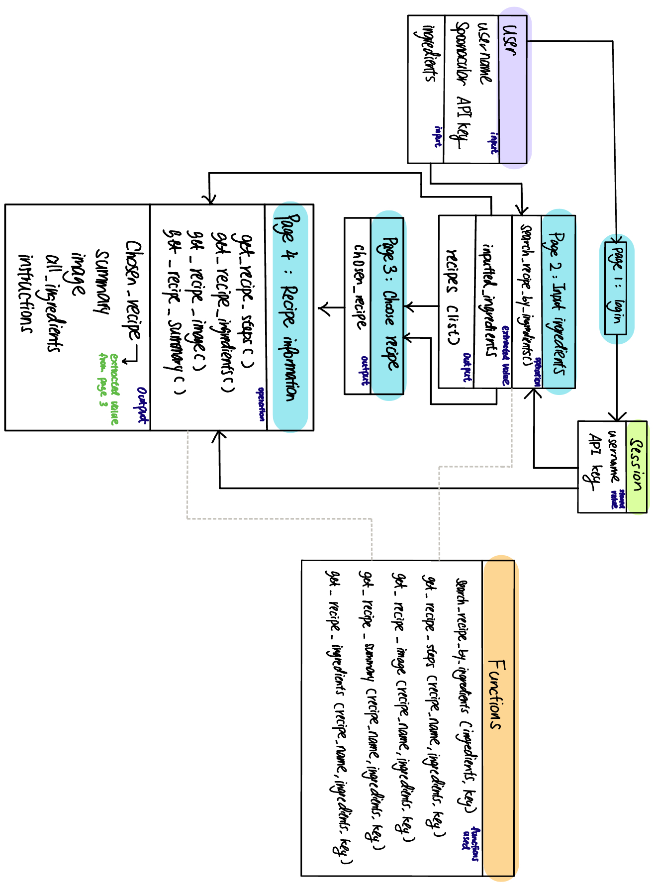

# Final Team Project

This is the repository for the final project of OIM 3640-02 2024 Spring

## Team Members

Marissa Yang and Xinjia Chen

## Big Idea/Goal/Why did we do this?

Q: Can you give a quick and easy explanation of your project's purpose? Consider using a narrative or example use case, such as via screenshots, video, or storyboarding.

We realized for alot of college students as well as young adults who are overwhelmed by daily schedules, cooking can be an albatrass where they experienced difficulty with deciding what to cook and how to cook with limited ingredients in their fridge. Based on our research, around 14% of college students conducted by the research of the University of North Carolina at Chapel Hill has never cooked. As such, we intend to help these students with cooking.

To help these young adults eat healthy from home, we deviced a website where they can simply input ingreditents they have on hand, and we help them generate a list of potential meals from which they can choose and get further detailed information on. The whole website is built upon the background story of Disney character Ratetouille to spice up their lives with a bit more fun and joy.

### More data based on research

Source: <https://www.sciencedirect.com/science/article/abs/pii/S1878450X21000020>

## User Instructions

Q: Provide guidance to users regarding downloading, installation, and initial use of your software. Here is a collection of incredible READMEs that can help you get started. Here is a website that helps you create a README.

### Step 1: Login

You are required to input thier username and Spoonacular API key in the first page. Spoonacular API key can be derived from the link:<https://spoonacular.com/food-api/console#Dashboard>

### Step 2: Input available ingredients

You are then asked to input ingredients they have on hand where different ingredients are seperated by ",".

### Step 3: Choose recipe

The website will provide a list of possible recipes for you to choose from. If you wish to start over, simply click the start over option at the bottom to insert different ingredients.

### Step 4: Get more information about the recipe

For the recipe selected in step 3, the website will provide more information about the recipe including: short description, image, ingredients needed with measurement, and a step by step instruction. If you wish to start over, simply click on the option at the bottom to return to home page.

### Error page

If there is any error occuring, the error image will inform you of the error and provide the option of returning to the home page.

## Implementation Information

Q: Code doesn't tell a story by itself. Use more effective methods such as flowcharts and architectural or class diagrams to explain how your code works. You could consider including or linking to snippets of code to highlight a particularly crucial segment.

This is a simple class diagram of how the website works.

## Results

Although each project will have unique details, showcasing your software's capabilities is essential! Screenshots and video can be especially useful. Include graphs and data, if appropriate.

## Project Evolution/Narrative

By exploring how your project developed over time, you can convey an illustrious story about creating software that improved throughout the process. You might include screenshots or other tools to demonstrate the project's evolution.

## Attribution

Ensure that you give appropriate credit for any external resources you used in your project.
