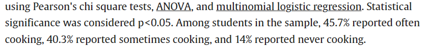
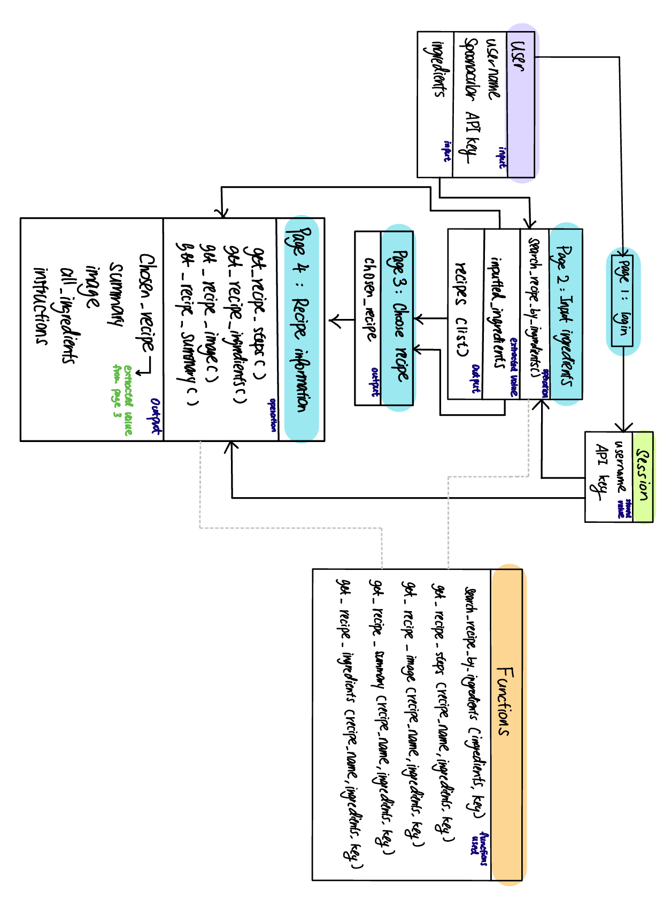
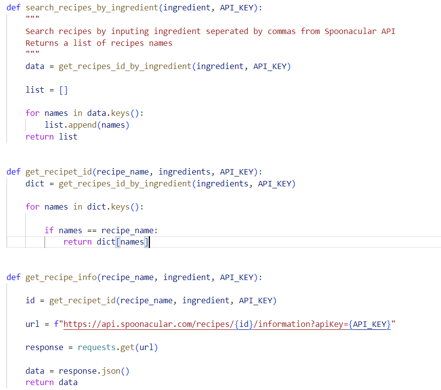
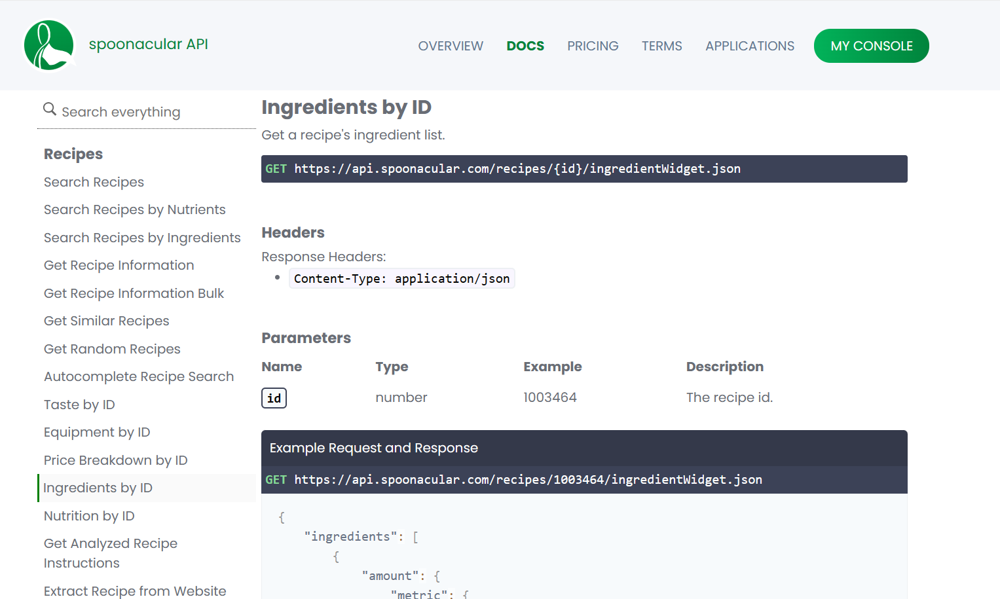

# Final Team Project

This is the repository for the final project of OIM 3640-02 2024 Spring

## Team Members

Marissa Yang and Xinjia Chen

## Big Idea/Goal/Why did we do this?

Q: Can you give a quick and easy explanation of your project's purpose? Consider using a narrative or example use case, such as via screenshots, video, or storyboarding.

We realized for alot of college students as well as young adults who are overwhelmed by daily schedules, cooking can be an albatrass where they experienced difficulty with deciding what to cook and how to cook with limited ingredients in their fridge. Based on our research, around 14% of college students conducted by the research of the University of North Carolina at Chapel Hill has never cooked. As such, we intend to help these students with cooking.

To help these young adults eat healthy from home, we deviced a website where they can simply input ingreditents they have on hand, and we help them generate a list of potential meals from which they can choose and get further detailed information on. The whole website is built upon the background story of Disney character Ratetouille to spice up their lives with a bit more fun and joy.

### More data based on research

Source: <https://www.sciencedirect.com/science/article/abs/pii/S1878450X21000020>

## User Instructions

Q: Provide guidance to users regarding downloading, installation, and initial use of your software. Here is a collection of incredible READMEs that can help you get started. Here is a website that helps you create a README.

### Step 1: Login

You are required to input thier username and Spoonacular API key in the first page. Spoonacular API key can be derived from the link:<https://spoonacular.com/food-api/console#Dashboard>

### Step 2: Input available ingredients

You are then asked to input ingredients they have on hand where different ingredients are seperated by ",".

### Step 3: Choose recipe

The website will provide a list of possible recipes for you to choose from. If you wish to start over, simply click the start over option at the bottom to insert different ingredients.

### Step 4: Get more information about the recipe

For the recipe selected in step 3, the website will provide more information about the recipe including: short description, image, ingredients needed with measurement, and a step by step instruction. If you wish to start over, simply click on the option at the bottom to return to home page.

### Error page

If there is any error occuring, the error image will inform you of the error and provide the option of returning to the home page.

## Implementation Information

Q: Code doesn't tell a story by itself. Use more effective methods such as flowcharts and architectural or class diagrams to explain how your code works. You could consider including or linking to snippets of code to highlight a particularly crucial segment.

This is a simple class diagram of how the website works. For each node, inputed data go through operations of different functions to produce outputs that are passed on to the next node.

## Results

Q: Although each project will have unique details, showcasing your software's capabilities is essential! Screenshots and video can be especially useful. Include graphs and data, if appropriate.

[Video of using the website](<https://babson-my.sharepoint.com/personal/zyang3_babson_edu/_layouts/15/stream.aspx?id=%2Fpersonal%2Fzyang3%5Fbabson%5Fedu%2FDocuments%2F%E9%99%84%E4%BB%B6%2FRecording%202024%2D04%2D26%20152720%2Emov&ct=1714160210276&or=OWA%2DNT%2DMail&cid=50078051%2D6de4%2D2b6f%2Dccf9%2D4cd931597e3b&ga=1&LOF=1&referrer=StreamWebApp%2EWeb&referrerScenario=AddressBarCopied%2Eview>)

## Project Evolution/Narrative

Q: By exploring how your project developed over time, you can convey an illustrious story about creating software that improved throughout the process. You might include screenshots or other tools to demonstrate the project's evolution.

### Developing functions

The most difficult part for us initially was creating function because upon reviewing the spoonacular API, we realized that for Spoonacular API are not built in a flow where we can, for example, simple extract more information about a recipe by recipe name. Instead, we need to find the specific ID for each recipe to conduct the search. This results in alot of reworks where we need to create new functions to record the ID of the list of recipes rendered by generating a dictionary with recipe name as key and ID as time. When the user chooses a specific recipe, we then need to insert the ID instead of the recipe name into new functions to extract useful information. We also noticed that Spoonacular API keys has a daily limite of 150 uses which posted a major hurdle when we try to test the webiste. Considering how using our own Spoonacular API keys in the functions might provide a bad exprience, we decided to add in a login page to let users input thier own API keys. This step, while easy in congestion, made us renovated all the functions as a new input varaibles API_key needs to be introduced to all functions as well as in the app.py file. Since API key is an import input needed in every page, we want to be able to pass the value to all pages, and to fullfill that need, we learned a new function called "session" with the help of ChatGPT. It has a similar concept to a locker where with a secret key, we can store inputed values in the "locker" and allow access of the value with "session.get()". This helped us alot as we won't need to extract the API information everytime we need in a seperate page.

#### Picture of functions mentioned before

#### Picture of the Spoonacular API

### Developing website pages

Redirect from a web page to another is another challenge we encountered as in class we merely covered how to get from a single page to a result page and terminates there. With the help of ChatGPT, we learned to use "post" method where we can simply extract information form the previous webpage and input in into the next html where results will be rendered. Another problem we encountered was to pass on the inputed ingredients information across webpages, so we included the line "input type="hidden" name="ingredients" value="{{ input }}" where the "input" inserted in the page is passed on as a input named as "ingredients" that can be easily referenced in the next page.

Additionally, another interesting thing we found was that the short summary we extracted for each recipe is actually already formatted in html style, which means when we input the summary into the web page, we need to find a way to have html treat it as html rather than text. We learned to use "{{summary | safe}}" where "safe" is a filter to ensure that the "summary" is rendered successfully as a html inside a html. To seperate "summary" from rest of the webpage, we also used "div" to create a seperate block for "summary" to render successfully.

### CSS Styling

When trying to add pictures into the website, we wanted to remove the background of the picture to make it look more natrual. However, after storing the picture in the same folder as the html and trying to load it, the web page had exprienced trouble rendering the picture, so we had to use new pictures with backrgounds instead.

For CSS styling, since we want to make the interface more smoothing and Disney-like, we defaulted all of the fonts to "font-family: 'Disney', cursive;" and used light blue and red to resemble the theme of Diney and the Ratetouille movie.

## Attribution

Q: Ensure that you give appropriate credit for any external resources you used in your project.

### References

[Spoonacular Webiste](<[https://spoonacular.com/food-api/docs#Ingredients-by-ID ](https://spoonacular.com/food-api)>)

[Source for safe filter](<https://stackoverflow.com/questions/3206344/passing-html-to-template-using-flask-jinja2>)

[Source for hidden input](<https://www.w3schools.com/tags/att_input_type_hidden.asp>)

[Source for methods of get and post](<https://www.w3schools.com/tags/ref_httpmethods.asp>)

[Source for html button](<https://www.w3schools.com/tags/tag_button.asp>)

[Source for CSS style](<https://www.w3schools.com/html/html_css.asp>)

[One thread of ChatGPT usage](<https://chat.openai.com/c/80dfdeb1-217d-4603-ace3-bf074397e5c5>)
